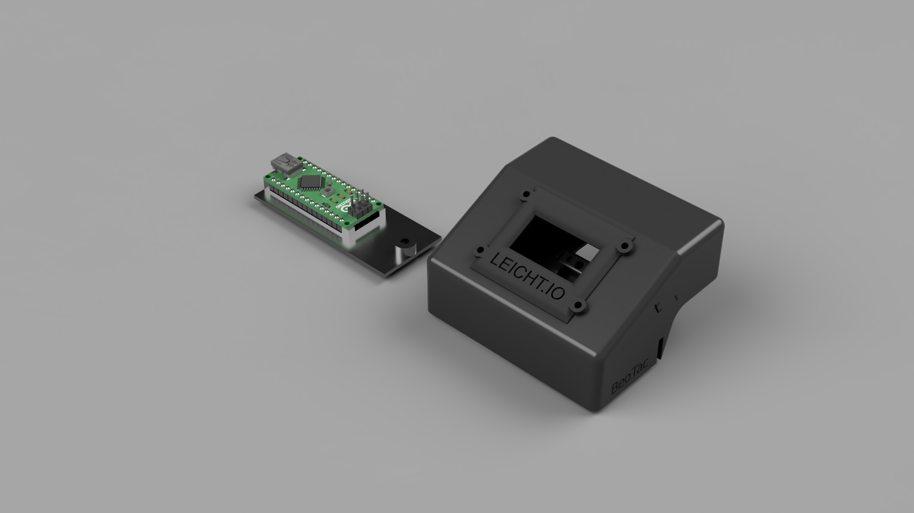
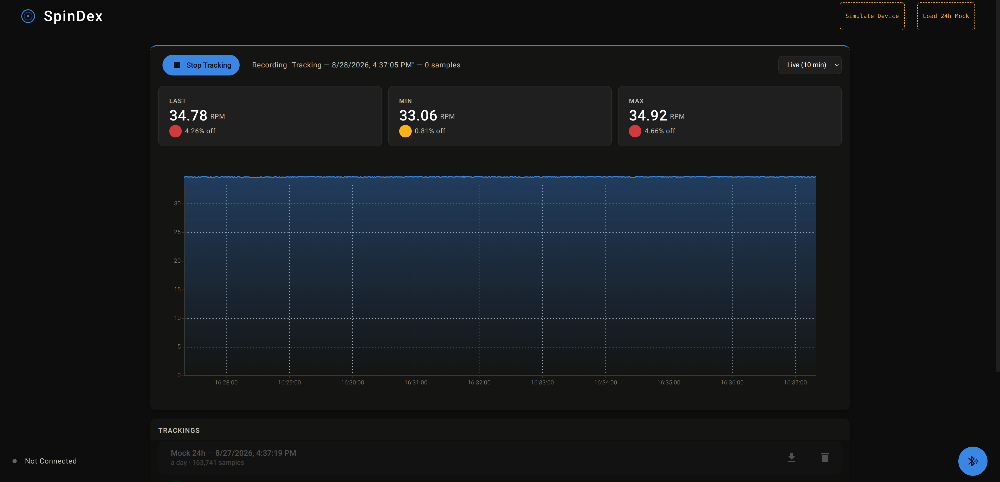

# SpinDex
SpinDex is a small RPM measurement tool for the Beogram 4000 series.
The main focus is to verify that the turntable is restored correctly and maintains the correct speed over an extended period.
The code is written to run on the M5Stack StampS3 (ESP32-S3) but could easily be ported to other microcontrollers and architectures.

This mono repository is divided into multiple sub-repositories, explained below:

### 3D Files (3d-files):
This folder contains all the 3D models.
- astreaus_body_v1.stl
- astreaus_bottom_v1.stl
- astreaus_led_v1.stl

---

### Web App (web-app)
This folder contains the web app. It connects to the controller over Bluetooth (Web Bluetooth — Chrome/Edge on desktop or Android, no install needed) and displays the live RPM as a temporal line graph. It's hosted publicly, free to use, at **https://spindex.leicht.io/**.

Features:
- Pair with the controller over Web Bluetooth, with automatic reconnect on a dropped connection so an unattended run rides out a transient disconnect.
- Start/stop tracking sessions, persisted locally in the browser (IndexedDB) — a page refresh or reconnect doesn't lose the running session.
- Keep multiple tracking sessions around and switch between them from the Trackings list, including revisiting past (stopped) sessions.
- Live stat tiles for current/min/max RPM and % deviation from the nominal 33⅓/45 RPM target, colour-coded by how far off spec.
- Selectable chart time window (Live 10 min / 1h / 6h / 12h / 24h / All), auto-bucketed to a fixed point budget so even a 24h session stays smooth to render.
- Gap-aware charting — a BLE disconnect or closed tab shows as a clearly marked gap in the plot rather than a misleading flat or interpolated line.
- CSV export of any tracking session for offline analysis.
- Delete old tracking sessions.
- Single dark, "precision-instrument" themed UI.

---

### µController Source Code (controller-source)
This folder contains the source code for the microcontroller.

---

### Documentation (documentation)
This folder contains the [sensor pin setup and wiring diagram](documentation/pinSetup.md). The PCB schematics themselves live in `hardware/carrier-board`, below.

---

### Hardware (hardware/carrier-board)
This folder contains the custom carrier board PCB design (KiCad) that
piggybacks the M5Stack StampS3 module and the TCRT5000 IR sensor front end
on a single board. See its own [README](hardware/carrier-board/README.md)
for the schematic writeup, BOM, and what's left before fabrication.

---

Please note that this project is in progress and prone to change. The following tasks needs to be implemented before i consider the SpinDex finished.

- tests
- custom-made PCB (in progress, see `hardware/carrier-board` — not yet routed or fabricated).

Feel free to develop further on the project and create PRs if, necessary. I would be happy to cooperate with others on the device.

Blog posts with more pictures:

- https://leicht.io/articles/beotac-a-tachometer-for-the-beogram-4000-series
- https://leicht.io/articles/updates-to-beotac
