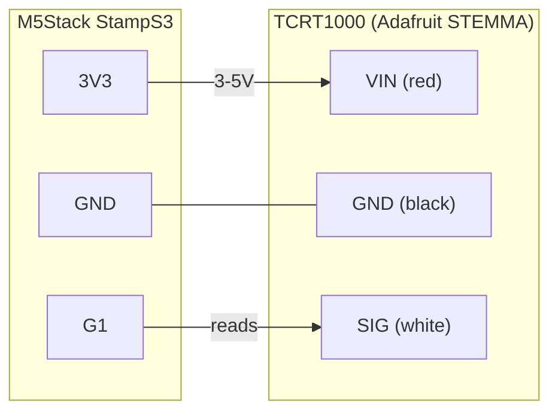

# Pin Setup

**Board:** M5Stack StampS3 (ESP32-S3)
**IR sensor:** [Adafruit STEMMA Reflective Photo Interrupt Sensor - TCRT1000](https://www.adafruit.com/product/5913)

## Wiring

| TCRT1000 (STEMMA JST-PH) | StampS3 pin | Notes |
|---|---|---|
| Red — VIN | `3V3` | Wired directly to the 3V3 rail, **not** a GPIO. The onboard emitter trimmer can draw up to ~100mA, more than a GPIO can safely source. |
| Black — GND | `GND` | |
| White — SIG | `G1` | Digital input. Idles HIGH with no reflection; drops toward 0V when the IR beam bounces back off a reflective surface. |

The sensor is aimed at the 24 alternating dark/reflective bars on the Beogram platter's strobe ring; each HIGH transition on `G1` marks one bar crossed.
