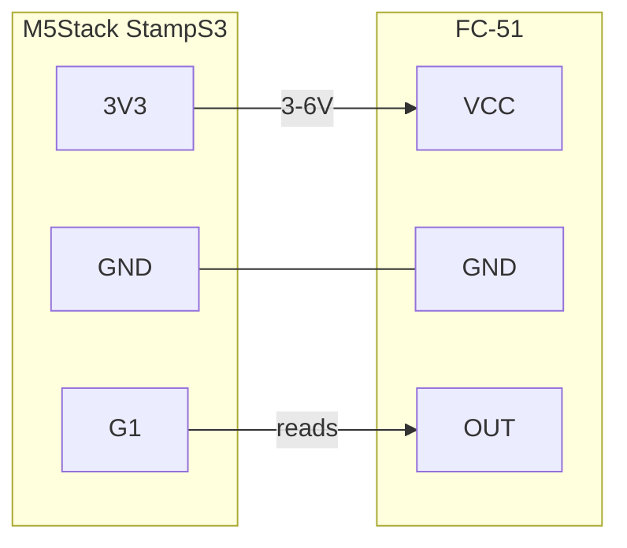

# Pin Setup

**Board:** M5Stack StampS3 (ESP32-S3)
**IR sensor:** FC-51 IR obstacle avoidance module (LM393 comparator, ~2-30cm adjustable range)

## Wiring

| FC-51 pin | StampS3 pin | Notes |
|---|---|---|
| VCC | `3V3` | Wired directly to the 3V3 rail, **not** a GPIO. Measured draw is ~23mA at 3.3V — close enough to GPIO source limits to keep it on the dedicated rail. |
| GND | `GND` | |
| OUT | `G1` | Digital input (already comparator-conditioned by the module, LM393). Idles HIGH with no reflection; drops LOW when the IR beam bounces back off a reflective surface. |

The sensor is aimed at the 24 alternating dark/reflective bars on the Beogram platter's strobe ring; each HIGH transition on `G1` marks one bar crossed.

### Mounting note

The FC-51's beam is ~35° wide, considerably wider than a focused sensor like the TCRT1000 (0.2-4mm range) it replaced. Mount it toward the **near end** of its adjustable range (a centimeter or two, not the full 30cm) and use the onboard trimpot to set a tight threshold rather than maximum sensitivity — the goal is a clean single-bar edge, not detecting several bars at once, which would blur transitions and throw off the RPM count. These LM393-based modules are also more sensitive to bright ambient/IR light than sensors with a daylight-blocking filter, so avoid testing in direct sunlight.

### Previously: TCRT1000

The original build used the [Adafruit STEMMA Reflective Photo Interrupt Sensor (TCRT1000)](https://www.adafruit.com/product/5913), wired VIN→3V3, GND→GND, SIG→G1 with identical polarity (idle HIGH, drops on reflection). It was replaced due to its very tight 0.2-4mm required sensing distance, which made consistent mounting difficult. If reverting, no firmware changes are needed — only the wiring.
